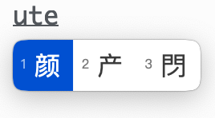
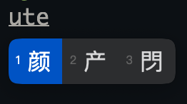
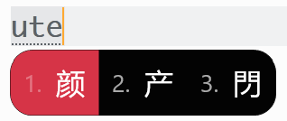
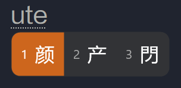
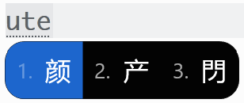
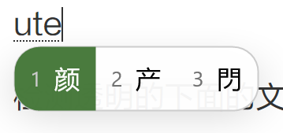

## 皮肤

`squirrel.custom.yaml` 是 Mac 上的鼠须管专用。

`weasel.custom.yaml` 是 Windows 上小狼毫专用。

## Mac 效果图

配置文件中已设置跟随系统自动切换暗色模式。

### 亮色

### 暗色

## Windows10/11 效果图

### 1、green_dark

### 2、red_dark

### 3、orange_dark

### 4、win10_black

### 5、透明亮色

