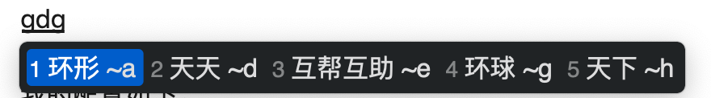
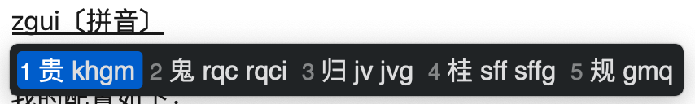

## 皮肤

`squirrel.custom.yaml` 是 Mac 上的鼠须管专用。

`weasel.custom.yaml` 是 Windows 上小狼毫专用。

## Mac 效果图

- 这是应用皮肤后的输入效果：
  
- 这是反查的效果：
  

皮肤是在 squirrel.yaml 里，名叫“mojave_dark”，配置可参考本仓库/build/squirrel.yaml。

## Windows10/11 效果图

### 1、green_dark

### 2、red_dark

### 3、orange_dark

### 4、win10_black

### 5、透明亮色

